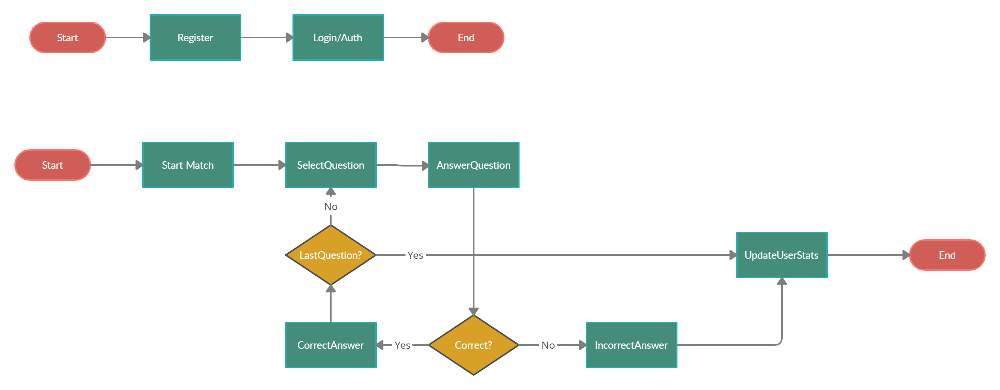

# Project
## _A quiz app designed for a college project_

## Features

- Add questions to the system
- View profile statistics
- Play and have fun

# Documentation

### Database Model

### Flow

## Tech

This project uses a number of open source projects to work properly:

### Links

- [Github Repository](https://github.com/antonio200598/Quizz-Show)
- [Interface Prototyping](https://www.figma.com/file/hSLlnNymgn4GL9zKUVcGxf/show-do-milh%C3%A3o?node-id=0%3A1)

### Members

- Ageu Oliveira da Costa 
- Antônio Mauricio Rodrigues Araújo Júnior 

